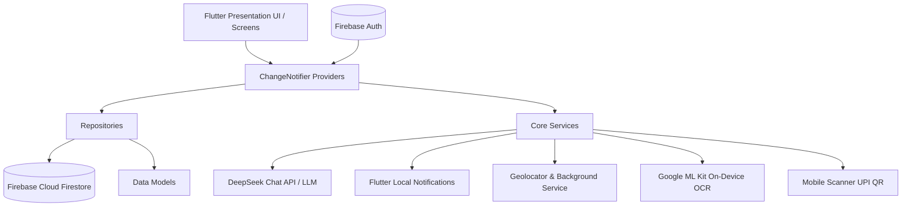

# 💰 SpendWise - Comprehensive Project Documentation & Architecture Guide

SpendWise is an intelligent, privacy-focused, cross-platform personal finance, expense tracking, and budget management application built using **Flutter**, **Firebase Cloud Firestore**, and **DeepSeek AI**.

---

## 📑 Table of Contents

1. [Project Overview](#-1-project-overview)
2. [System Architecture](#-2-system-architecture)
   - [Architectural Layers](#architectural-layers)
   - [High-Level Architecture Diagram](#high-level-architecture-diagram)
   - [State Management & Data Flow](#state-management--data-flow)
3. [Deep-Dive into Features](#-3-deep-dive-into-features)
   - [Expense Logging & Smart Input Methods](#1-expense-logging--smart-input-methods)
   - [AI-Powered Capabilities (DeepSeek LLM)](#2-ai-powered-capabilities-deepseek-llm)
   - [Budget Planning & Management](#3-budget-planning--management)
   - [Bill Reminders & Automation](#4-bill-reminders--automation)
   - [Borrowed Money & Debt Repayment](#5-borrowed-money--debt-repayment)
   - [Savings Goals & AI Savings Coach](#6-savings-goals--ai-savings-coach)
   - [Social Split Expenses & Group Finances](#7-social-split-expenses--group-finances)
   - [Analytics, Charts & Reporting](#8-analytics-charts--reporting)
   - [Proactive Reminders & Background Geolocation](#9-proactive-reminders--background-geolocation)
   - [Monthly Lifecycle & Savings Review](#10-monthly-lifecycle--savings-review)
4. [Data Architecture & Firestore Schema](#-4-data-architecture--firestore-schema)
   - [Firestore Collection Structure](#firestore-collection-structure)
   - [Data Models Breakdown](#data-models-breakdown)
5. [Tech Stack & Key Dependencies](#-5-tech-stack--key-dependencies)
6. [Design System & Theming](#-6-design-system--theming)
7. [Directory & File Structure](#-7-directory--file-structure)
8. [Setup & Configuration Guide](#-8-setup--configuration-guide)
9. [Security, Privacy & Offline Strategy](#-9-security-privacy--offline-strategy)

---

## 🌟 1. Project Overview

Managing personal finances is often tedious and fragmented across bank alerts, paper receipts, split bills with roommates, and upcoming bill dues. **SpendWise** addresses this by serving as an all-in-one financial assistant that combines:
- **Zero-effort capture**: ML Kit OCR receipt scanning, UPI QR code scanning, and phonebook contacts integration.
- **Deep intelligence**: DeepSeek AI budget planning with debt-strategy optimization, real-time transaction auto-categorization, and an interactive savings coach.
- **Proactive lifecycle management**: Background location-based purchase prompts, recurring 10:00 PM check-ins, end-of-month savings reviews, and multi-channel budget threshold notifications.
- **Social finances**: Group creation and equal/custom bill splitting with settled status tracking.

---

## 🏛️ 2. System Architecture

SpendWise is built on **Clean Layered Architecture** with separation of concerns across presentation, state management, business/data access logic, and hardware/platform services.

```
┌─────────────────────────────────────────────────────────┐
│                   PRESENTATION LAYER                    │
│   Screens (16 feature domains) • Custom Widgets • Charts│
└────────────────────────────┬────────────────────────────┘
                             │ uses / observes
┌────────────────────────────▼────────────────────────────┐
│                  STATE MANAGEMENT LAYER                 │
│         11 ChangeNotifier Providers (Provider)          │
│   (Auth, Expense, Budget, Bills, Savings, Split, etc.)  │
└──────────────┬───────────────────────────┬──────────────┘
               │ calls                     │ calls
┌──────────────▼─────────────┐ ┌───────────▼──────────────┐
│      REPOSITORY LAYER      │ │    CORE SERVICES LAYER   │
│  10 Domain Repositories    │ │ - DeepSeek AI Service    │
│  (Cloud Firestore Sub-     │ │ - Notification Service   │
│   collection Access)       │ │ - Location Background Svc│
└──────────────┬─────────────┘ │ - OCR & QR Svc           │
               │               └──────────────────────────┘
┌──────────────▼──────────────────────────────────────────┐
│                   PERSISTENCE & CLOUD                   │
│   Firebase Auth • Cloud Firestore • SharedPreferences   │
└─────────────────────────────────────────────────────────┘
```

### Architectural Layers

1. **Presentation Layer (`lib/presentation/`)**:
   - **Screens**: Grouped logically by domain (`expense`, `budget`, `savings_goals`, `analytics`, `split_expenses`, etc.).
   - **Widgets**: Atomic reusable widgets (`ExpenseCard`, `AlertBanner`, `MonthlyReviewBottomSheet`, `ZeroBudgetWarningDialog`) and visualizations (`fl_chart` wrappers).
2. **State Management Layer (`lib/providers/`)**:
   - Built on `package:provider` using `ChangeNotifier`.
   - Subscribes to real-time streams from repositories and exposes reactive UI state.
   - Decouples UI controllers from Firestore network queries and handles errors gracefully.
3. **Data Layer (`lib/data/`)**:
   - **Models**: Immutable entity representations extending `Equatable` with `toMap()`, `fromMap()`, and `copyWith()` helpers.
   - **Repositories**: Encapsulates Firestore queries, document references, and batch updates.
   - **Services**: Device-specific services (`OCRService`, `QRProcessorService`).
4. **Core Layer (`lib/core/`)**:
   - Central application constants, color themes, input validators, notification schedulers, location tracking, and external AI integrations.

### High-Level Architecture Diagram



### State Management & Data Flow

SpendWise leverages **Reactive Streams** for Firestore:
1. When a screen initializes (e.g. `HomeScreen`), it commands the provider to listen to user collections.
2. The Repository opens a Firestore `.snapshots()` stream ordered by date.
3. Every Firestore snapshot triggers a parse into typed models, updating provider internal state and invoking `notifyListeners()`.
4. UI widgets rebuild efficiently using `context.watch<T>()` or `Consumer<T>`.
5. Local mutations (e.g., adding an expense) are pushed to Firestore via repositories; UI automatically receives the reactive update via the stream.

---

## 🚀 3. Deep-Dive into Features

### 1. Expense Logging & Smart Input Methods
- **Manual Input**: Quick-entry form with category selection, date picker, split flag, and description.
- **On-Device Receipt OCR**:
  - Uses `google_mlkit_text_recognition`.
  - Runs 100% locally on the device (no receipt image is uploaded to cloud storage).
  - Regex pattern matching extracts amount (₹ / Rs / INR), receipt date, and merchant name.
  - Automatically loads extracted details into the Add Expense form.
- **UPI QR Code Scanning**:
  - Built with `mobile_scanner`.
  - Parses standard UPI URI specifications (`upi://pay?...`), extracting payee name (`pn`), amount (`am`), and note (`tn`).
  - Identifies payment providers (Paytm, PhonePe, Google Pay).
  - Deep-links directly to external payment apps (`url_launcher`).
- **Contacts Integration**:
  - Uses `flutter_contacts` to access address book.
  - Allows linking expenses to friends without manual typing.

### 2. AI-Powered Capabilities (DeepSeek LLM)
Integrated via `DeepSeekService` using the `deepseek-chat` model with secure `.env` credentials:
- **AI Budget Planner**:
  - Formulates a complete category-wise budget based on user income, target spending limit, active debts, and upcoming bills.
  - Supports debt mitigation strategies (**Aggressive**, **Balanced**, **Light**).
  - Strictly enforces JSON structured output to guarantee reliable parsing.
- **Smart Expense Auto-Categorization**:
  - Analyzes expense description using zero-shot classification to categorize spending into available categories (`Food & Dining`, `Rent/EMI`, `Travel & Transport`, etc.).
  - Fallback fuzzy string matching ensures high resilience.
- **Interactive AI Savings Coach**:
  - Dedicated bottom sheet (`SavingsGoalChatSheet`) allowing natural language conversation with an AI financial mentor.
  - Injects contextual metadata (target amount, saved amount, days remaining, deadline, user monthly income) into the system prompt.
  - Provides actionable tips to keep the user accountable.

### 3. Budget Planning & Management
- **50/30/20 Rule Support**: Recommends 50% Needs, 30% Wants, and 20% Savings.
- **Real-Time Category Tracking**: Tracks monthly expenditure against category allocations.
- **Proactive Budget Warnings**:
  - Warning alert at **80%** threshold.
  - Danger alert at **90%** threshold.
  - Exceeded alert banner with dismiss options.
- **Zero-Budget Shield (`ZeroBudgetWarningDialog`)**:
  - If a user attempts to log an expense in a category with ₹0 budget allocation, an alert notifies them with the option to adjust the budget or proceed anyway.

### 4. Bill Reminders & Automation
- **Recurrence Support**: None, Weekly, Monthly, Quarterly, Yearly, or Custom interval in days.
- **Overdue & Due Soon Tracking**: Dynamic calculation of overdue status and upcoming deadlines.
- **Automated Expense Conversion**:
  - Marking a bill as "Paid" automatically creates a corresponding transaction in the Expense repository.
- **Scheduled Notifications**:
  - Schedules system notifications `X` days before bill due dates using `flutter_local_notifications`.

### 5. Borrowed Money & Debt Repayment
- Tracks money borrowed from or lent to specific persons.
- Tracks pending debt vs settled transactions.
- **Automated Outflow Sync**: When an unpaid debt is marked as "Paid", SpendWise automatically creates an expense entry titled `Borrowed Money Repayment` to ensure actual bank balance calculations remain consistent.
- **Debt-Aware Budget Generation**: Feeds unpaid debt directly into the AI Budget Planner.

### 6. Savings Goals & AI Savings Coach
- **Goal Parameters**: Name, target amount, current amount, target date, category emoji.
- **Visual Analytics**: Custom painted circular progress indicator with percentage fill.
- **Financial Projections**: Computes days remaining and suggested required monthly savings rate.
- **Deposit Tracking**: Easy deposit dialog to add contributions step-by-step.
- **AI Chat Coach**: Built-in chat assistant dedicated to each goal.

### 7. Social Split Expenses & Group Finances
- **Group Management**: Create named groups (e.g., Roommates, Trip, Office) with custom emojis.
- **Flexible Splitting Algorithms**:
  - **Equal Split**: Even division across all selected members.
  - **Custom Split**: Individual allocation per friend with automatic remainder calculation.
- **Settlement Tracking**: Per-member settlement status (`settled: { friendId: true/false }`).

### 8. Analytics, Charts & Reporting
Integrated via `fl_chart`:
- **Spending by Category**: Interactive pie chart with category color mapping and percentage labels.
- **Spending Trend**: 6-month historical trend line chart showing spending trajectory over time.
- **Budget vs Actual Comparison**: Dual bar charts comparing budgeted amounts against actual expenditures per category.
- **Top Expense Categories**: Quick-reference ranked list of highest spending sectors.

### 9. Proactive Reminders & Background Geolocation
- **Daily 10:00 PM Notification**:
  - Scheduled via `timezone` and local notifications to prompt users before the day ends.
- **Smart Background Location Reminder (`LocationService`)**:
  - Uses `flutter_background_service` and `geolocator`.
  - Listens to significant physical displacement (100 meters).
  - Triggers a prompt: *"Did you just make a purchase? You are on the move! Tap here to quickly log any expenses."*

### 10. Monthly Lifecycle & Savings Review
- **Monthly Income Onboarding (`MonthlyIncomeScreen`)**:
  - Enforced on first login and on the 1st of each new month.
  - Prompts user to input monthly income and target savings goal.
- **End-of-Month Review (`MonthlyReviewBottomSheet`)**:
  - Appears automatically during the last 5 days of any month.
  - Prompts the user for their actual saved amount.
  - Evaluates saved amount against savings goals and presents celebratory feedback.

---

## 🗄️ 4. Data Architecture & Firestore Schema

### Firestore Collection Structure

Data in Firestore is partitioned per user under a single root collection for enhanced privacy and multi-tenancy:

```
expense_tracker/
└── users/
    └── users/
        └── {userId}/
            ├── expenses/{expenseId}
            ├── budgets/{budgetId}
            ├── monthly_expenses/{monthId}
            ├── bill_reminders/{billId}
            ├── borrowed_money/{borrowedId}
            ├── savings_goals/{goalId}
            ├── friends/{friendId}
            ├── groups/{groupId}
            └── split_expenses/{splitId}
```

### Data Models Breakdown

| Model | Key Fields | Description |
| :--- | :--- | :--- |
| **`UserModel`** | `id`, `email`, `name`, `monthlyIncome`, `savingsGoal`, `budgetLimits`, `lastIncomeSetMonth`, `lastMonthReviewCompleted` | Core user profile and global monthly financial limits. |
| **`ExpenseModel`** | `id`, `userId`, `amount`, `category`, `description`, `date`, `isSplit`, `splitDetails`, `ocrData`, `isIncome` | Individual expense or income entry. |
| **`BudgetModel`** | `id`, `userId`, `monthlyIncome`, `savingsGoal`, `categoryBudgets` (Map), `month` | Monthly planned budget per category. |
| **`MonthlyExpenseModel`** | `id`, `userId`, `month`, `categoryExpenses` (Map), `createdAt` | Aggregated monthly totals for fast reporting. |
| **`BillReminderModel`** | `id`, `userId`, `billName`, `amount`, `category`, `dueDate`, `recurrenceType`, `reminderDaysBefore`, `isPaid`, `autoCreateExpense` | Upcoming and recurring bill reminders. |
| **`BorrowedMoneyModel`** | `id`, `userId`, `personName`, `amount`, `date`, `description`, `isPaid`, `paidDate` | Money borrowed or lent to individuals. |
| **`SavingsGoalModel`** | `id`, `userId`, `name`, `targetAmount`, `currentAmount`, `targetDate`, `category`, `emoji`, `isCompleted` | Dedicated financial target with progress metrics. |
| **`FriendModel`** | `id`, `userId`, `friendId`, `name`, `email`, `photoUrl`, `addedAt` | Connected friends for bill splitting. |
| **`GroupModel`** | `id`, `userId`, `name`, `emoji`, `memberIds`, `createdDate` | Named friend groupings for bulk bill splitting. |
| **`SplitExpenseModel`** | `id`, `expenseId`, `creatorId`, `totalAmount`, `category`, `splits` (Map), `settled` (Map) | Shared expense with individual friend allocations. |
| **`PaymentQRData`** | `provider`, `merchantName`, `amount`, `transactionNote`, `originalUrl`, `upiParams` | Extracted UPI QR data object. |

---

## 🛠️ 5. Tech Stack & Key Dependencies

| Domain | Technology / Library | Purpose |
| :--- | :--- | :--- |
| **Framework** | Flutter (SDK `^3.10.0`), Dart | Cross-platform UI toolkit |
| **Cloud Backend** | Firebase Core, Cloud Firestore, Firebase Auth | Real-time database, cloud sync, authentication |
| **State Management** | `provider: ^6.1.2` | Reactive state management using `ChangeNotifier` |
| **Artificial Intelligence** | DeepSeek Chat API (`http: ^1.2.1`, `flutter_dotenv`) | Budget planning, auto-categorization, savings chat |
| **Computer Vision (OCR)** | `google_mlkit_text_recognition: ^0.13.1` | Local on-device receipt text parsing |
| **QR Code Processing** | `mobile_scanner: ^5.2.3`, `url_launcher: ^6.3.1` | UPI QR scanner and app launcher |
| **Hardware & Sensors** | `geolocator: ^14.0.2`, `flutter_background_service: ^5.1.0` | Background location tracking & movement detection |
| **Notifications** | `flutter_local_notifications: ^20.1.0`, `timezone: ^0.10.1` | Scheduled local alerts & reminders |
| **Contacts** | `flutter_contacts: ^1.1.7+1`, `permission_handler: ^11.3.1` | Address book integration |
| **Visualizations** | `fl_chart: ^0.69.2` | Interactive pie, line, and bar charts |
| **Typography & Theme** | `google_fonts: ^6.2.1` | Premium typography (Inter font family) |
| **Utilities** | `equatable`, `intl`, `uuid`, `shared_preferences` | Model equality, date formatting, UUID generation |

---

## 🎨 6. Design System & Theming

SpendWise implements **Material 3** principles with a curated, modern aesthetic:
- **Primary Palette**:
  - Indigo Primary (`#6C63FF`)
  - Cyan Secondary (`#00D4FF`)
  - Coral Accent (`#FF6584`)
  - Success Green (`#06FFA5`)
  - Warning Amber (`#FCBF49`)
  - Error Coral (`#FF4757`)
- **Theme Modes**:
  - Full **Light** and **Dark Mode** support managed reactively via `ThemeProvider`.
  - Dark mode features deep indigo-slate surfaces (`#1A1A2E` and `#16213E`) with reduced eye strain.
- **Typography**:
  - Uses the **Inter** font family via `GoogleFonts` across display, body, and label text styles.
- **Visual Polish**:
  - Gradients for primary action buttons and floating action buttons (FABs).
  - Smooth card elevations and rounded corners (`16px` - `24px`).
  - Consistent category color-coding (e.g., Red for Food, Cyan for Travel, Purple for Loans).

---

## 📁 7. Directory & File Structure

```
expense_tracker/
├── .env                                  # API keys (DeepSeek API Key, etc.)
├── pubspec.yaml                          # Dependencies and assets
├── README.md                             # Repository overview
├── PROJECT_DOCUMENTATION.md              # Complete architecture & features guide
│
├── lib/
│   ├── main.dart                         # App entry, services initialization, providers
│   ├── firebase_options.dart             # FlutterFire auto-generated configuration
│   │
│   ├── core/
│   │   ├── constants/
│   │   │   └── app_constants.dart        # Categories, icons, colors, Firestore keys
│   │   ├── services/
│   │   │   ├── deepseek_service.dart     # DeepSeek AI API integration (budget, chat, OCR)
│   │   │   ├── location_service.dart     # Background location monitoring service
│   │   │   └── notification_service.dart # Local notification scheduler & handlers
│   │   ├── theme/
│   │   │   └── app_theme.dart            # Light & dark themes, color palette, gradients
│   │   └── utils/
│   │       └── validators.dart           # Email, password, and number form validators
│   │
│   ├── data/
│   │   ├── models/                       # 11 Domain models (Expense, User, Budget, etc.)
│   │   ├── repositories/                 # 10 Firestore repository classes
│   │   └── services/
│   │       ├── ocr_service.dart          # Google ML Kit receipt extraction
│   │       └── qr_processor_service.dart # UPI QR code parsing & deep-linking
│   │
│   ├── providers/                        # 11 ChangeNotifier providers
│   │   ├── auth_provider.dart
│   │   ├── expense_provider.dart
│   │   ├── budget_provider.dart
│   │   ├── savings_goal_provider.dart
│   │   ├── bill_reminder_provider.dart
│   │   ├── borrowed_money_provider.dart
│   │   ├── split_expense_provider.dart
│   │   ├── friend_provider.dart
│   │   ├── group_provider.dart
│   │   ├── monthly_expense_provider.dart
│   │   └── theme_provider.dart
│   │
│   └── presentation/
│       ├── screens/
│       │   ├── analytics/                # Analytics dashboard with FL Charts
│       │   ├── auth/                     # Login & registration screens
│       │   ├── bill_reminders/           # Bill list, add, and edit screens
│       │   ├── borrowed_money/           # Debt tracking and repayment screens
│       │   ├── budget/                   # Budget planner & monthly expense entry
│       │   ├── expense/                  # Add, edit, all expenses, receipt scan
│       │   ├── friends/                  # Friends & group management
│       │   ├── home/                     # Main home dashboard
│       │   ├── more/                     # More menu with navigation & settings
│       │   ├── navigation/               # Bottom navigation scaffold with notched FAB
│       │   ├── onboarding/               # First-of-month income setup screen
│       │   ├── profile/                  # User profile and financial limits
│       │   ├── qr_scanner/               # UPI QR code scanner screen
│       │   ├── savings_goals/            # Goals, deposit dialog, AI coach chat sheet
│       │   ├── splash/                   # Animated splash screen
│       │   └── split_expenses/           # Bill split creation and settlement view
│       │
│       └── widgets/
│           ├── alert_banner.dart         # Budget warning and alert banner
│           ├── expense_card.dart         # Styled individual transaction item
│           ├── monthly_review_bottom_sheet.dart # End-of-month savings review
│           ├── ocr_result_dialog.dart    # OCR extraction preview & confirm dialog
│           ├── qr_result_dialog.dart     # UPI QR parsed preview dialog
│           ├── qr_scanner_overlay.dart   # Camera scanner cutout overlay
│           ├── zero_budget_warning_dialog.dart # Alert dialog for unallocated spending
│           └── charts/
│               ├── budget_comparison_chart.dart # Budget vs actual bar chart
│               ├── category_pie_chart.dart      # Category expenditure breakdown pie chart
│               └── spending_line_chart.dart     # 6-month historical spending curve
```

---

## ⚡ 8. Setup & Configuration Guide

### 1. Prerequisites
- **Flutter SDK**: `^3.10.0` or later
- **Dart SDK**: `^3.10.0` or later
- **Firebase Project**: Configured with Authentication & Cloud Firestore
- **DeepSeek API Key**: For AI Budget Planner, Auto-Categorization, and Savings Coach

### 2. Environment Variables (`.env`)
Create a `.env` file in the project root:
```env
DEEPSEEK_API_KEY=your_deepseek_api_key_here
```
Ensure `.env` is listed under assets in `pubspec.yaml`:
```yaml
flutter:
  assets:
    - .env
```

### 3. Firebase Setup
Run the FlutterFire CLI:
```bash
dart pub global activate flutterfire_cli
flutterfire configure
```
This updates `firebase_options.dart` and links your Android/iOS configurations.

### 4. Running the App
```bash
# Fetch dependencies
flutter pub get

# Generate launcher icons (optional)
flutter pub run flutter_launcher_icons

# Run on connected device or emulator
flutter run
```

---

## 🔒 9. Security, Privacy & Offline Strategy

1. **Local OCR Execution**:
   - Receipt images are analyzed on-device using Google ML Kit.
   - Images are **never** stored on remote servers or third-party cloud buckets, safeguarding personal transaction data.
2. **Private Data Isolation**:
   - Firestore security rules restrict user data strictly to `request.auth.uid == userId`.
   - Subcollections guarantee that no user can query or mutate another user's transactions.
3. **Resilient Offline Architecture**:
   - Cloud Firestore offline persistence is enabled by default, allowing read/write operations without active network connectivity.
   - Local mutations synchronize automatically when connectivity is restored.
4. **Fallback AI Logic**:
   - If network connectivity is absent or the DeepSeek API key is not configured, the budget planner gracefully falls back to deterministic 50/30/20 mathematical algorithms.

---

<div align="center">
  <b>SpendWise • Intelligent Expense Tracking & Personal Finance Management</b>
</div>
